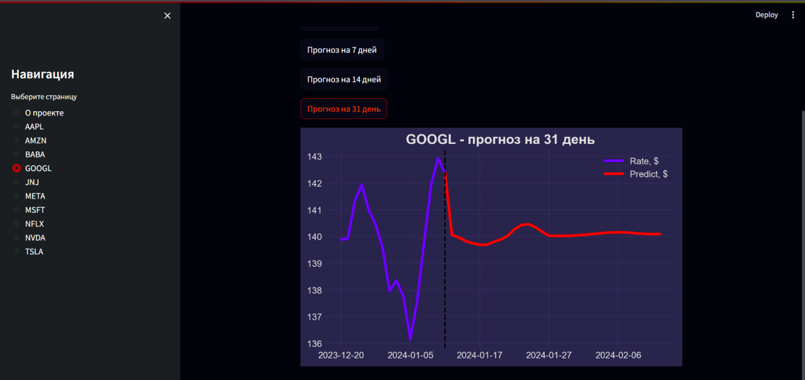

# Прогнозирование акций с использованием статистических моделей

Проект прогноза акций на основе статистических моделей скользящего среднего и линейных зависимостей. 

При запуске скрипта прогноза, выполняется парсинг последних 3-ёх лет котировок акций с yfinance. Далее делаются прогнозы стоимости акций на различные временные интервалы (вплоть до месяца). Результаты прогноза сохраняются в виде CSV-файлов.

Frontend созданн с использованием фреймворка Streamlit. На веб-сайте можно выбрать тикер акции и временной интервал прогноза (3 дня, 7 дней, 14 дней, 31 день).

